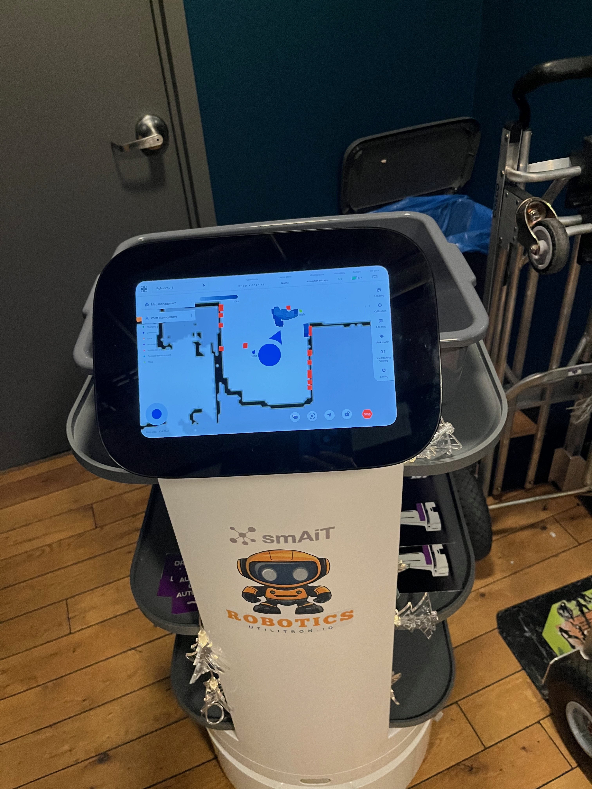
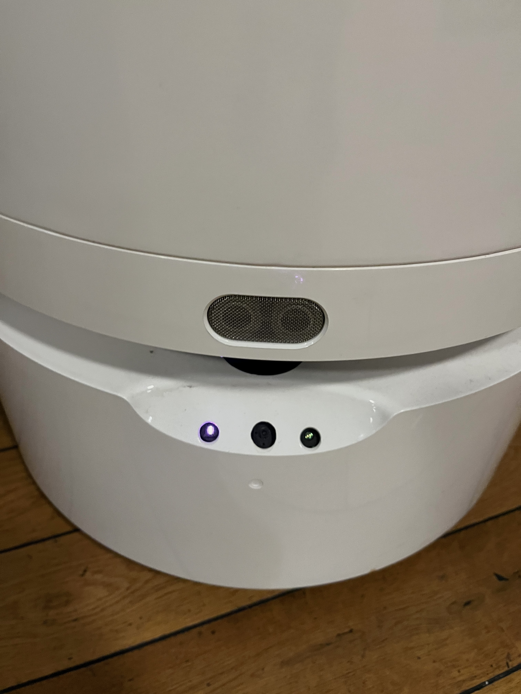

# RobotOS Pro

**Transform Your $20,000 Planter Into A 7-Mode Automation Platform**

[]()
[]()
[]()
[]()

## The $8 Billion Market Opportunity

### The Problem: 100,000+ Underutilized Robots
- **Pudu Robotics:** 80,000+ units deployed globally (2020-2024), most running legacy firmware
- **CIOT:** 10,000+ annual production, primarily Chinese market with basic software
- **Industry Reality:** 200,000 service robots sold in 2024, but hospitality sector seeing -11% utilization
- **The Truth:** Most of these $13,000-$23,000 robots are glorified planters because the OEM software doesn't deliver

### Why This Matters
Every Pudu, CIOT, and smAiT robot ships with:
- ✅ Android tablet (usually 10"+)
- ✅ Rockchip or similar ARM processor
- ✅ rosbridge-compatible base
- ❌ Software that actually makes them useful

**We fix the ❌ for FREE** (first month), then $299/month for the features that make managers heroes.

### The Math That Matters
- Your robot cost: $3,000 - $23,000 (new Chinese models dropping fast!)
- Current utility: ~5% (generous estimate)
- With RobotOS Pro: 70-90% utilization
- Monthly cost: $299-2,999 (scales with capability)
- Typical labor saved: 20-40 hours/week
- ROI: Usually under 30 days with new $3k robots

### Who This Is For
- **Frustrated Managers** who bought robots that don't work
- **Smart Operators** who want 10x more from existing hardware
- **Forward Thinkers** ready for true automation
- **Anyone** with a Pudu/CIOT/smAiT robot gathering dust

## Screenshots & Real World Deployments

### Flutter Control App

*Real-time SLAM map showing Droid 39 navigating to Front Door waypoint*


*Tour sequence editor with multi-stop configuration and timing controls*

### Robot Hardware


*smAiT service robot running RobotOS Pro - Android tablet displaying real-time navigation map with path planning*


*Robot base unit showing ultrasonic sensors, status indicators, and clean industrial design*

### Coming Soon
- Food service deployments in restaurants
- Healthcare facility implementations
- Corporate office installations

## Overview

RobotOS Pro is a comprehensive multi-mode operating system that transforms underutilized service robots into versatile business automation platforms. Built for Pudu, smAiT, CIOT, and compatible platforms using the rosbridge protocol, it enables sophisticated operations across hospitality, healthcare, office, and retail environments.

### Multi-Mode Platform - One Robot, Endless Possibilities

#### 🎭 **Tour Mode** - Automated Guided Tours
- Multi-stop sequences with TTS narration
- Custom media display at each waypoint
- Visitor engagement tracking
- Perfect for: Museums, offices, hotels, showrooms

#### 📦 **Delivery Mode** - Smart Logistics
- Multi-destination route optimization
- Proof of delivery confirmation
- Customer notification system
- Perfect for: Room service, mail delivery, pharmacy

#### 🍽️ **Busser Mode** - Table Service Automation
- Dish collection patterns
- Kitchen return routing
- Load detection and balancing
- Perfect for: Restaurants, cafeterias, event venues

#### 🚨 **Emergency Mode** - Crisis Response
- Evacuation route guidance
- Emergency broadcast system
- First responder coordination
- Perfect for: Hotels, hospitals, office buildings

#### 🔒 **Patrol Mode** - Security Operations
- Scheduled security rounds
- Anomaly detection and reporting
- Integration with security systems
- Perfect for: Warehouses, campuses, retail after-hours

#### 👋 **Greeter Mode** - Reception Automation
- Visitor welcome and check-in
- Wayfinding assistance
- Appointment validation
- Perfect for: Lobbies, hospitals, corporate reception

#### 🎪 **Comic Mode** - Entertainment & Engagement
- Interactive joke telling
- Trivia and games
- Dance routines and performances
- Perfect for: Children's areas, events, marketing

### Key Platform Features

- 🤖 **Universal Compatibility** - Works with any rosbridge-compatible robot
- 🌐 **WAN-Ready Architecture** - gRPC protocol for reliable internet-scale operation
- 🎯 **Smart Navigation** - Automatic path recovery with obstacle avoidance
- 🧠 **Dynamic Task Composition** - Cloud-based behavior stacking (coming soon)
- ☁️ **Cloud Fleet Management** - AWS-powered multi-robot coordination
- 📱 **Cross-Platform Control** - Flutter apps for iOS, Android, Web, and Desktop

## System Architecture

```
┌─────────────────────────────────────────────────────────────┐
│                    INTERNET / WAN                           │
│                                                             │
│   Flutter Apps          Cloud               Android Relay   │
│   ┌──────────┐         ┌──────┐            ┌──────────┐   │
│   │Controller│ ←gRPC→  │ AWS  │  ←gRPC→    │  Tablet  │   │
│   └──────────┘ :443    │ IoT  │   :50051   │  Bridge  │   │
│                        └──────┘             └────┬─────┘   │
└─────────────────────────────────────────────────│──────────┘
                                                   │
                                        WebSocket  │ :9090
                                                   ▼
                                          ┌──────────────┐
                                          │ Robot Base   │
                                          │ Controller   │
                                          └──────────────┘
```

## Components

### 1. Flutter Control App (`flutter_app/`)
Universal controller with adaptive UI based on robot capabilities.

**Features:**
- Dynamic UI generation from robot introspection
- Tour creation and management
- Real-time status monitoring
- Voice command support
- Cloud synchronization

**Supported Platforms:**
- iOS 12.0+
- Android 7.0+ (API 24)
- Web (Chrome, Safari, Firefox)
- macOS 10.14+
- Windows (coming soon)
- Linux (coming soon)

### 2. Android Relay Bridge (`relay_app/`)
Tablet-based bridge providing WAN connectivity and customer interaction.

**Features:**
- gRPC server (port 50051) for WAN communication
- WebSocket relay to robot base
- Customer-facing tour display
- Command buffering for reliability
- TTS announcements
- Recovery logic for navigation failures

**Requirements:**
- Android 7.0+ (API 24)
- Tablet with 10"+ screen recommended

### 3. Cloud Infrastructure (`infrastructure/`)
AWS-based fleet management and tour synchronization.

**Services:**
- API Gateway for REST endpoints
- Lambda functions for business logic
- DynamoDB for tours, maps, and waypoints
- IoT Core for real-time telemetry (planned)

## Quick Start

### 1. Deploy Cloud Infrastructure (Optional)
```bash
cd infrastructure
aws cloudformation deploy \
  --template-file frontiertower-stack.yaml \
  --stack-name robotour-stack \
  --capabilities CAPABILITY_NAMED_IAM
```

### 2. Install Android Relay on Tablet
```bash
cd relay_app
./gradlew assembleDebug
adb install app/build/outputs/apk/debug/app-debug.apk
```

### 3. Run Flutter Controller
```bash
cd flutter_app
flutter pub get
flutter run -d [platform]  # ios, android, chrome, macos
```

### 4. Connect to Robot
1. Connect tablet to robot via USB or robot WiFi
2. Start relay service on tablet
3. Enter tablet IP in Flutter app
4. Begin controlling robot!

## Mode Implementation Details

### Current Status
- ✅ **Tour Mode** - Fully implemented with cloud sync
- 🔧 **Delivery Mode** - In development (Q1 2026)
- 🔧 **Busser Mode** - In development (Q1 2026)
- 🔧 **Emergency Mode** - In development (Q2 2026)
- 🔧 **Patrol Mode** - In development (Q2 2026)
- 🔧 **Greeter Mode** - In development (Q1 2026)
- 🔧 **Comic Mode** - In development (Q1 2026)

## Recent Updates (January 2026)

### Reliability Improvements
- **Sequential Command Loading** - Commands sent to relay with confirmation before tour starts
- **SINC-Style Health Checks** - Heartbeat staleness detection on app resume and tour start
- **Case-Insensitive Waypoints** - Waypoint matching normalized to prevent missed stops
- **REST AT END Fix** - Timer now starts after arrival, not before

### UX Changes
- **Screen Lock Disabled** - Full HUD visible during tours (no "Do not touch" overlay)
- **Wakelock Active** - Screen stays on during tours to prevent connection drops

## Tour Mode (Fully Operational)

### Creating Tours
Tours consist of waypoints with:
- **Navigation targets** - POI names the robot knows
- **Narration scripts** - Text-to-speech at each stop
- **Media display** - URLs for tablet display
- **Wait timings** - Dwell time at each location

### Tour Execution
1. Load tour from cloud or create locally
2. Robot navigates to each waypoint sequentially
3. At each stop:
   - Display media on tablet
   - Play arrival sound
   - Announce narration
   - Wait specified duration
4. Return to start or end position

### Recovery Behavior
When navigation fails:
1. Announce "Looking for alternative path"
2. Backup slowly (5cm/s)
3. Rotate to find clear direction
4. Attempt alternate route
5. After 3 failures: Request human assistance

## Protocol Support

### Primary: gRPC (WAN-Ready)
- Binary protobuf encoding (15x smaller than JSON)
- Built-in keepalive (HTTP/2 PING)
- Automatic reconnection
- Bidirectional streaming

### Legacy: WebSocket (LAN)
- JSON rosbridge protocol
- Direct robot connection
- Real-time telemetry
- Map visualization

## Map Data & Base Integration

### Available Data from Robot Base

The robot base provides rich mapping and navigation data via ROS topics and services:

#### Currently Implemented (Read-Only)

| Data | Topic/Service | Type | Update Rate | Purpose |
|------|---------------|------|-------------|---------|
| **Occupancy Grid** | `/map` | `nav_msgs/OccupancyGrid` | 5s polling | SLAM map visualization |
| **Robot Pose** | `/robot_pose` | `geometry_msgs/Pose2D` | Real-time | Position overlay on map |
| **Robot Status** | `/robot_status` | Custom | Real-time | Battery, nav_status, velocity |
| **Waypoints** | `/poi` service | String array | On-demand | Available navigation targets |
| **Laser Scan** | `/laser_data` | Point array | Available | LIDAR visualization |

#### Available but Not Yet Implemented

| Data | Topic/Service | Type | Purpose |
|------|---------------|------|---------|
| **Global Costmap** | `/move_base/global_costmap` | `nav_msgs/OccupancyGrid` | Path planning costs |
| **Local Costmap** | `/move_base/local_costmap` | `nav_msgs/OccupancyGrid` | Obstacle avoidance |
| **Global Path** | `/global_path` | Path | Current planned route |
| **Map Metadata** | `/get_map_info` service | Custom | Resolution, origin, bounds |
| **Robot Info** | `/robot_info` service | Custom | Hardware capabilities |

#### Not Available (Requires Custom Implementation)

| Feature | Status | Notes |
|---------|--------|-------|
| **Virtual Walls** | Not in base firmware | Would need custom SLAM node |
| **Restricted Zones** | Not in base firmware | Could implement in relay |
| **Corridors/Paths** | Not in base firmware | Path overlays possible in app |
| **Zone-based Speed** | Logic exists, no zones | Uses lidar distance instead |

### Map Data Flow

```
┌─────────────────────────────────────────────────────────────────┐
│                    ROBOT SLAM SYSTEM                            │
│  ┌─────────────┐  ┌─────────────┐  ┌─────────────┐              │
│  │   /map      │  │ /robot_pose │  │   /poi      │              │
│  │ OccupancyGrid│  │   Pose2D    │  │  Service    │              │
│  └──────┬──────┘  └──────┬──────┘  └──────┬──────┘              │
└─────────┼────────────────┼────────────────┼─────────────────────┘
          │                │                │
          ▼                ▼                ▼
   ┌──────────────────────────────────────────────────────────────┐
   │                    RELAY SERVER (:8765)                       │
   │  • Caches /map as PNG (HTTP GET /map)                        │
   │  • Forwards /robot_pose via WebSocket                        │
   │  • Proxies /poi service calls                                │
   └───────────────────────────┬──────────────────────────────────┘
                               │
                               ▼
   ┌──────────────────────────────────────────────────────────────┐
   │                    FLUTTER APP                                │
   │  • Polls /map every 5s → renders to Canvas                   │
   │  • Subscribes /robot_pose → overlays position                │
   │  • Calls /poi → populates waypoint picker                    │
   │  • Syncs waypoints/tours ↔ Cloud DynamoDB                    │
   └──────────────────────────────────────────────────────────────┘
```

### Current Capabilities Discovery

On connection, the app performs parallel discovery:

```dart
// Discovers what the robot can do
RobotCapabilities caps = await RobotIntrospection(client).discover();

caps.topics;      // All ROS topics (via /rosapi/topics)
caps.services;    // All ROS services (via /rosapi/services)
caps.parameters;  // All ROS params (via /rosapi/get_param_names)
caps.waypoints;   // Navigation targets (via /poi service)

// Helper methods
caps.hasMap;           // Can display SLAM map
caps.hasNavigation;    // Can navigate to waypoints
caps.hasVelocityControl; // Can be manually driven
caps.hasStatus;        // Has telemetry stream
```

### Waypoint Management

**From Robot:**
```dart
// Get available waypoints from robot's map
List<String> waypoints = await robot.discoverWaypoints();
// Calls: /poi service with {'poi': ''} → returns {'avaliable_list': [...]}
```

**From Cloud:**
```dart
// Sync waypoints to/from cloud storage
FleetCloudClient cloud = FleetCloudClient();
List<String> waypoints = await cloud.getWaypoints(mapId: 'building_floor_4');
await cloud.pushWaypoints(waypoints, mapId: 'building_floor_4');
```

### Future: Map Modification (Roadmap)

#### Phase 1: Position Correction (Q1 2026)
- Manually adjust robot position when SLAM drifts
- Use `/initialpose` topic to reset localization
- Critical for multi-floor operations

#### Phase 2: Waypoint Management (Q2 2026)
- Add/rename/delete waypoints from app
- Requires custom service on relay or base
- Cloud sync for fleet-wide updates

#### Phase 3: Zone Definition (Q3 2026)
- Define no-go zones in app
- Restricted areas for safety
- Speed limit zones
- Relay-enforced (intercept navigation commands)

#### Phase 4: Dynamic Mapping (Future)
- Auto-adjust to venue changes
- Crowd-pushed position recovery
- Real-time obstacle integration
- "The caterer moved the drink table" scenario

### Services Reference

| Service | Arguments | Returns | Purpose |
|---------|-----------|---------|---------|
| `/poi` | `{'poi': ''}` | `{'avaliable_list': [...]}` | List waypoints |
| `/poi` | `{'poi': 'name'}` | Navigation result | Go to waypoint |
| `/get_map_info` | `{'cmd': 0}` | Map metadata | Get map details |
| `/robot_info` | `{'cmd': 0}` | Robot metadata | Get robot info |
| `/velocity_control` | `{speed: 0.5}` | OK | Set max speed |
| `/rosapi/topics` | none | Topic list | Introspection |
| `/rosapi/services` | none | Service list | Introspection |

## Development

### Requirements
- Flutter 3.0+
- Android Studio 2023.1+ (for relay app)
- Python 3.8+ (for cloud deployment)
- protoc 3.20+ (for gRPC generation)

### Building from Source

**Flutter App:**
```bash
cd flutter_app
flutter pub get
flutter build [ios|android|web|macos]
```

**Android Relay:**
```bash
cd relay_app
./gradlew build
```

**Generate Protobuf:**
```bash
cd flutter_app
./generate_protos.sh

cd relay_app
./gradlew generateProto
```

## Configuration

### Robot Connection
Default IPs can be modified in:
- Flutter: `lib/core/robot_connection.dart`
- Relay: `res/values/strings.xml`

### Tour Scripts
Place narration scripts in:
- Cloud: DynamoDB `tours` table
- Local: `assets/tour_scripts/`

### Recovery Settings
Adjust in `RecoveryConfig`:
- Stuck threshold: 15s
- Max attempts: 3
- Backup speed: 0.05 m/s
- Spin speed: 0.3 rad/s

## API Reference

### REST Endpoints
```
GET  /tours              - List all tours
POST /tours              - Create tour
PUT  /tours/{id}         - Update tour
GET  /maps/{id}/waypoints - Get waypoints for map
POST /fleet/commands     - Send command to robot
```

### gRPC Services
```protobuf
service RobotControl {
  rpc ControlStream(stream ClientMessage) returns (stream ServerMessage);
  rpc SendCommand(Command) returns (CommandResponse);
}
```

## Real-World Success Stories

### Before RoboTour Pro
- **Hotel Manager, California:** "We spent $18,000 on a delivery robot. It delivered maybe 3 items a day. Guests called it 'the expensive obstacle.'"
- **Office Manager, New York:** "Our Pudu robot literally holds a plant now. $20,000 planter."
- **Restaurant Owner, Texas:** "The robot worked for 2 weeks, then the software crashed. Support wanted $5,000 to fix it."

### After RoboTour Pro
- **Same Hotel:** "Now it gives 20+ tours daily, delivers room service, and guests love it. Best $299/month we spend."
- **Same Office:** "It now gives client tours, delivers mail, and our reception saves 3 hours daily. The robot paid for itself."
- **Same Restaurant:** "Fixed in 20 minutes for FREE. Now handles 50% of our deliveries. Saved two FTEs."

## Deployment Scenarios

### Instant Recovery Mode (FREE Trial)
- Install our software on existing tablet
- Robot immediately becomes functional
- Access to ALL 7 operational modes
- Basic navigation and delivery features
- Prove value before paying anything

### Professional Mode ($299/month)
- All 7 operational modes fully unlocked:
  - Tour, Delivery, Busser, Emergency, Patrol, Greeter, Comic
- Cloud synchronization and backup
- Custom mode configurations
- Analytics and reporting
- Priority support
- Custom branding

### Enterprise Mode ($999/month)
- Multi-facility fleet management
- Custom mode creation via API
- Dynamic task composition
- White-label options
- Integration with existing systems
- SLA guarantee

### Intelligence Mode ($2,999/month)
- Computer vision integration
- Crowd dynamics AI
- Predictive navigation
- Voice interaction
- Self-learning behaviors
- Custom AI model training

## Troubleshooting

### Connection Issues
- Verify tablet and controller on same network
- Check firewall allows ports 50051 (gRPC) and 8766 (WebSocket)
- Ensure robot WiFi credentials are correct

### Navigation Problems
- Confirm waypoints exist in robot's map
- Check battery level > 20%
- Verify no emergency stop active

### Tour Issues
- Validate all waypoint names match robot POIs (case-insensitive)
- Ensure TTS language matches script language
- Check tablet volume for announcements
- If tour freezes: Check relay heartbeat connection
- Map not updating: Verify HTTP polling to relay :8765/map

## Contributing

Contributions welcome! Please read [CONTRIBUTING.md](CONTRIBUTING.md) for guidelines.

## License

MIT License - see [LICENSE](LICENSE) for details.

## Support

- Documentation: [docs/](docs/)
- Email: alan@utilitron.io

---

**RobotOS Pro** - *One Robot. Seven Modes. Endless Possibilities.*